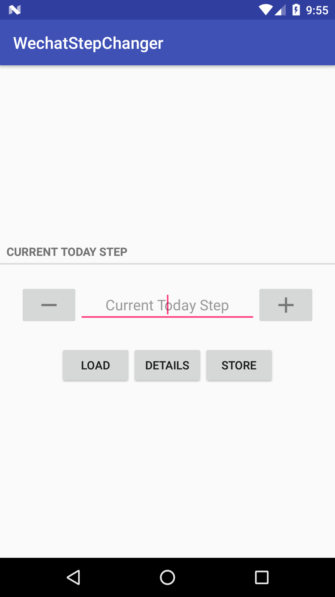
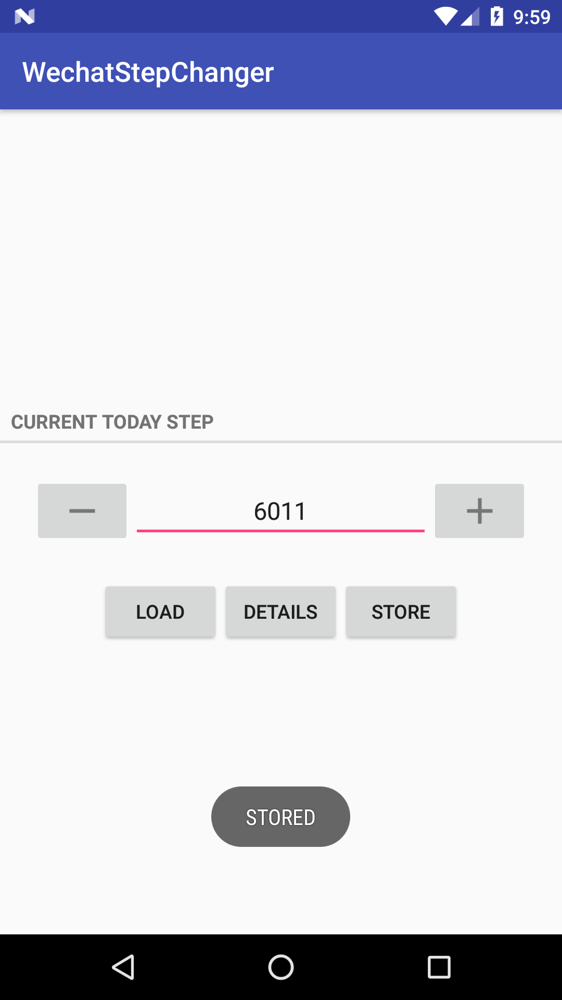
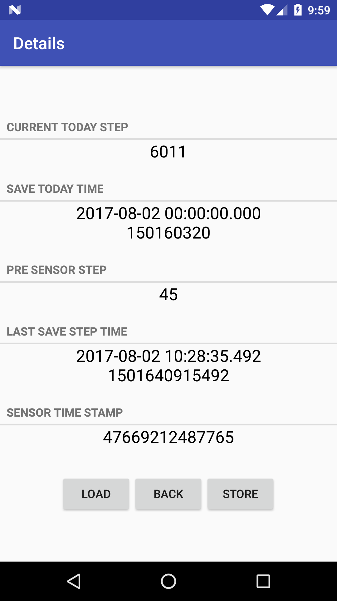

# 微信运动步数修改器


<h1><font color="red">本项目已废弃，移步<a href="https://github.com/iweizime/StepChanger" >步数修改器</a></font></h1>

## 注意

- 需要手机支持`Step Counter Sensor`

- 需要`Root`获取`stepcounter.cfg`文件的读写权限，应用仅使用Root权限执行如下命令：
    - `chmod o+rw /data/data/com.tencent.mm/MicroMsg/stepcounter.cfg`
    - `chmod o+x /data/data/com.tencent.mm/MicroMsg/`
    
    如果不想授予应用Root权限，或者应用没有成功执行命令，也可以手动执行上面两条命令。

- 不要一次改的太多，会被检测为异常。从3k改到5w是不行的，其他的没测试过

支持Android 5.1以上系统，仅在Android 7.x系统上测试过

## 界面

<div align="center">
    
    
    
    
</div>

## 原理

通过研究微信的`onSensorChanged`函数，发现微信运动的步数是保存在`/data/data/com.tencent.mm/MicroMsg/stepcounter.cfg`文件里面的。用Linux的file命令检查`stepcounter.cfg`的文件格式，结果为`stepcounter.cfg: Java serialization data, version 5`。这种文件通过`ObjectInputStream`和`ObjectOutputStream`来读写，实际上`stepcounter.cfg`文件保存的是一个`HashMap`, 其格式为:
```
{209=47669212487765, 201=6011, 202=150160320, 203=45, 204=1501640915492}
```
其中
- 键值`201`对应的就是当前今日步数
- 键值`202`对应的是今日开始时间(timestamp / 10)
- 键值`203`对应的是`step counter sensor`的步数
- 键值`204`对应的是上次保存时间

所以通过修改键值`201`对应的值就可以修改微信步数。在修改时，应用会调用`am.killBackgroundProcesses("com.tencent.mm")`来杀死后台微信进程（因为只有当微信启动的时候才会从`stepcounter.cfg`读取数据，其他时候都是保存数据）。

最后推荐一下Hook工具[Frida](https://github.com/frida)

